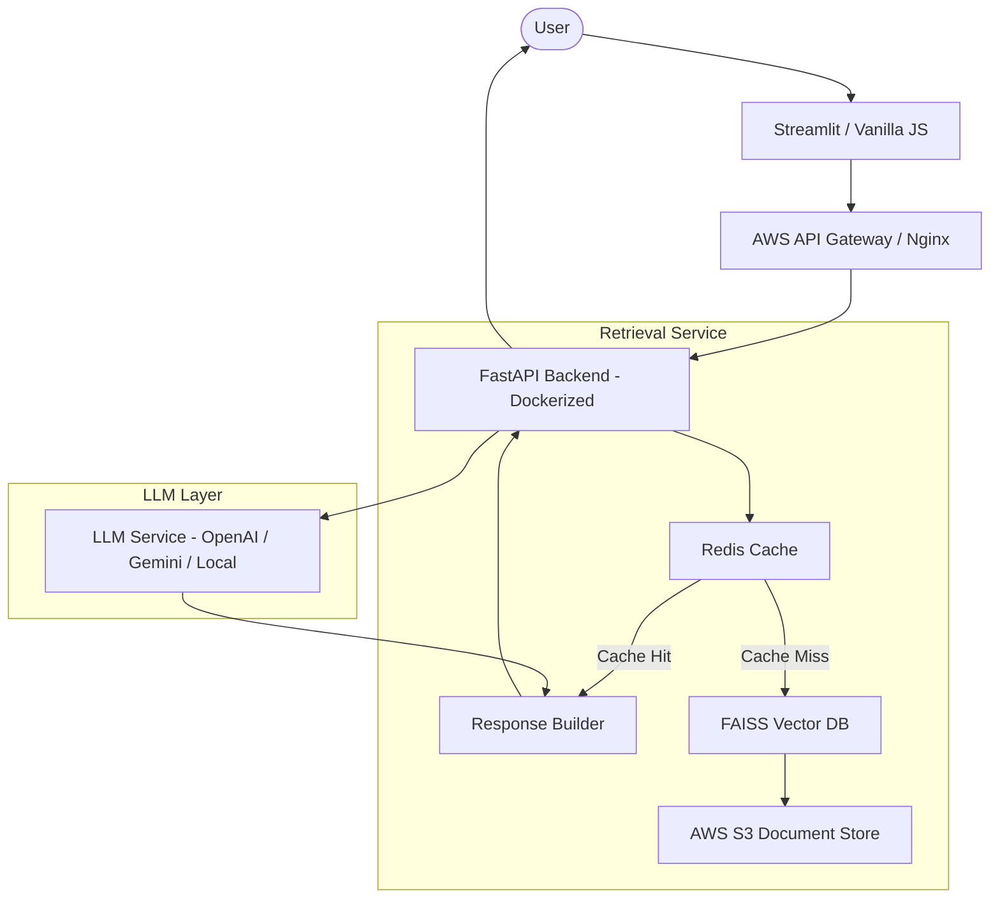

# Implementation Plan: Production Medical Literature RAG Assistant

Design and deploy a scalable, low-latency, and cost-optimized RAG pipeline for medical literature, serving up to 1 million users.

## User Review Required

> [!IMPORTANT]
> **Vector Database Choice**: I recommend **FAISS** (on EC2) for maximum cost control or **Pinecone** for managed ease-of-use. This plan assumes FAISS with S3 persistence for cost optimization.
> **LLM Layer**: To balance cost and performance for 1M users, I propose a hybrid approach: **Gemini 1.5 Flash** for high-volume tasks and **GPT-4o/Claude 3.5 Sonnet** for complex clinical reasoning.
> **Deployment**: We will use **AWS EC2 with Docker Compose** for initial deployment, with a path to **ECS/Fargate** for auto-scaling.

## Proposed Architecture

## Proposed Changes

### 1. Infrastructure & Backend [NEW]
Build a robust FastAPI backend designed for high concurrency using `asyncio` and `gunicorn/uvicorn` worker patterns.

#### [NEW] [Dockerfile](file:///d:/Data_Science_N_AI/MyResources/Anti_gravity/ProductionRAG2/Dockerfile)
- Multi-stage build for optimized image size.
- Includes FAISS, Redis-py, and FastAPI dependencies.

#### [NEW] [docker-compose.yml](file:///d:/Data_Science_N_AI/MyResources/Anti_gravity/ProductionRAG2/docker-compose.yml)
- Orchestrates FastAPI, Redis, and a local FAISS index volume.

#### [NEW] [app/main.py](file:///d:/Data_Science_N_AI/MyResources/Anti_gravity/ProductionRAG2/app/main.py)
- Entry point for the FastAPI application.
- Implements middleware for logging and basic rate limiting.

### 2. Retrieval & Caching Service
Optimize retrieval latency and reduce LLM costs.

#### [NEW] [app/services/vector_store.py](file:///d:/Data_Science_N_AI/MyResources/Anti_gravity/ProductionRAG2/app/services/vector_store.py)
- Integration with FAISS.
- Logic for loading/saving index to AWS S3.

#### [NEW] [app/services/cache_service.py](file:///d:/Data_Science_N_AI/MyResources/Anti_gravity/ProductionRAG2/app/services/cache_service.py)
- Semantic caching using Redis to store frequently asked medical queries and their RAG responses.

### 3. LLM & Prompt Engineering
#### [NEW] [app/services/llm_service.py](file:///d:/Data_Science_N_AI/MyResources/Anti_gravity/ProductionRAG2/app/services/llm_service.py)
- Async implementation for LLM calls.
- Failover logic between multiple providers (OpenAI, Gemini).

### 4. AWS Deployment Strategy
- **EC2 Instance**: t3.xlarge or higher (Graviton recommended for cost) with Docker installed.
- **S3 Bucket**: For persisting FAISS indices and raw medical PDFs/Docs.
- **IAM Roles**: Secure access for EC2 to S3.

## Cost Optimization Strategies
- **Semantic Caching**: Reduces LLM API calls by ~30-50% for common queries.
- **Quantized Embeddings**: Reduces memory footprint of the vector database.
- **Batch Ingestion**: Uses AWS Lambda or background tasks for document processing to avoid blocking the main API.

## Verification Plan

### Automated Tests
- `pytest` for backend API endpoints.
- Integration tests for Redis connectivity and FAISS search.

### Manual Verification
- Deploy to a staging EC2 instance and test concurrency using `locust` or `ab`.
- Verify S3 persistence by restarting the Docker containers.
